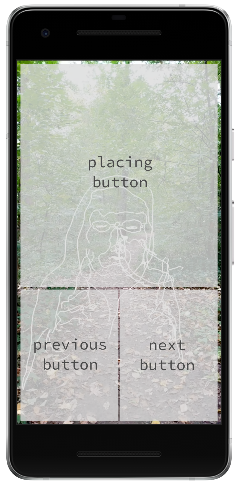

NormanAR
======

This is a complementary app to [James Paterson's](https://github.com/presstube) [NormanVR](https://normanvr.com/) [project](https://github.com/presstube/norman) that displays norman animations in augmented reality using [ARCore](https://developers.google.com/ar/) and [openFrameworks](http://openframeworks.cc/). 

	
	

Two versions of the app are included in this repo and they both do exactly the same thing: draw norman animations and place them in space. The difference is that the `normanARShader` version shows how you can work with shaders and ARCore. 

Please note this app currently only works with Android phones that support [ARCore](https://developers.google.com/ar/discover/). 

## Usage Details

For now, there are three "invisible" buttons you can tap. The bottom third of the screen contains a *next* and *previous* button to cycle through animations. The rest of the screen is for the *placing* button, which anchors an animation to a specific place in space.  

## Setup
1. **Prepare your device for use with ARCore**: first you need to install the ARCore service on your device. The best way to do so is to follow [these](https://developers.google.com/ar/develop/downloads) instructions.  

2. **Download an experimental version of openFrameworks**: To use ARCore we currently have to use a special version of openFrameworks (OF). This will change in the near future, but for now snatch [this](https://github.com/halfdanj/openframeworks/tree/android-camera-permissions) version of OF. 

3. **Download openFrameworks libraries**: You'll also need to download a few additional libraries for OF. Simply run the `download_libs.sh` script found in `openFrameworks/scripts/android/`. 

4. **Get ofxARCore**: Download the openFrameworks ARCore [addon](https://github.com/HalfdanJ/ofxARCore). Unzip the folder and move it to the addons folder so your path looks like so: `openFrameworks/addons/ofxARCore/`.

5. **Download NormanAR**: Download this repo, unzip it and place it within the apps folder in openFrameworks. The path to the norman app should be: `openFrameworks/apps/normanAR/`.

6. **Download Android Studio**: The app has been tested with [Android Studio 2](https://developer.android.com/studio/index.html). 

7. **Open NormanAR with Android Studio**: Use the "Open an existing Android Studio project" option and open either the `normanAR/normanAR` project or the `normanAR/normanARShader` project. Once that's launched, you'll have to set the project path to Android NDK r12b. Download the NDK [here](https://dl.google.com/android/repository/android-ndk-r12b-darwin-x86_64.zip). Then set the new NDK path in your "Project Structure" settings. If you're confused about how to do that, read the "Compile the app on Android Studio" section in this [getting started](https://medium.com/energeia/getting-started-with-openframeworks-on-android-5202b92f6582) guide.

8. **Build the project and deploy to your phone:** Have fun

By default, Android Studio will deploy a debug version of the app to your phone. The release version will run much faster, but to deploy that you'll have to build a [signed APK](https://www.udacity.com/wiki/ud853/course_resources/creating-a-signed-apk) for your phone. 

If you're generally new to openFrameworks and confused about installation, [this getting started guide](https://medium.com/energeia/getting-started-with-openframeworks-on-android-5202b92f6582) has some general pointers even though it uses a more stable branch of OF. 

## Creating custom animations

Each version of the app comes with four animations (each in the form of a json file) stored within the `bin/data/animations` folder. More animations can be found in the `animations/` folder. The more json files you load, the longer it will take for your app to open. 

More details for creating your own custom animations to come soon. 

---

## Authors
* [Irene Alvarado](https://twitter.com/ire_alva)
* [Jonas Jongejan](https://twitter.com/halfdanj)

This is not an official Google product, but part of a larger collaborative experiment between [James Paterson](http://www.presstube.com/hello/) and Google Creative Lab.

---

## Troubleshooting
* For general openFrameworks and Android Studio problems checkout this [getting started](https://medium.com/energeia/getting-started-with-openframeworks-on-android-5202b92f6582) guide. 
* After installing the APK on your phone, make sure the camera permissions for the app are set appropriately. Go to `Settings > App info > normanAR > Permissions` and make sure the camera permissions is turned on. 

## Final Thoughts
We encourage open sourcing projects as a way of learning from each other. Please respect our and other creators’ rights, including copyright and trademark rights when present, when sharing these works and creating derivative work. If you want more info on Google's policy, you can find that [here](https://www.google.com/permissions/).
